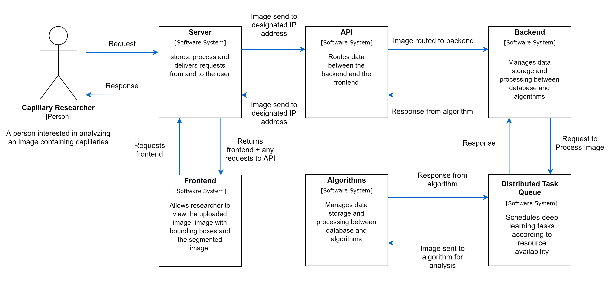
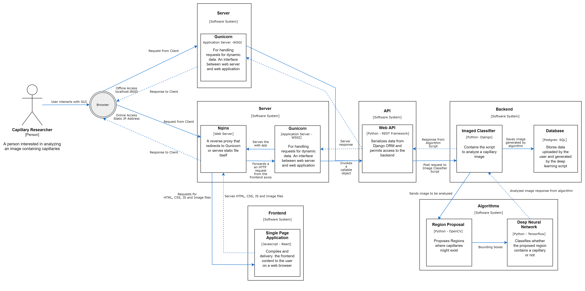
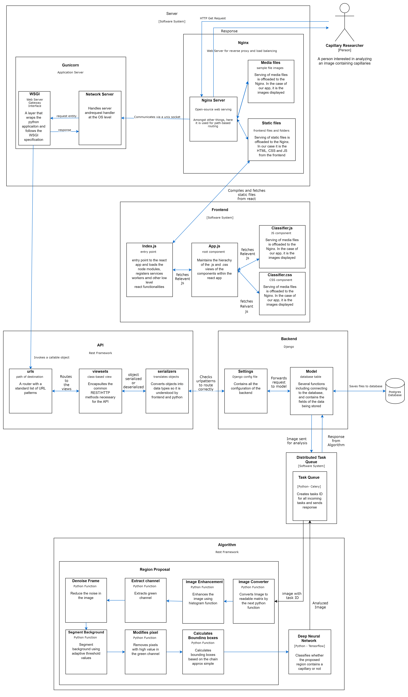

# Summary

Analyzing the microvascular supply by quantifying the capillary area can predict life-threatening diseases like Sepsis.
Estimating the capillary area can assist medical personals in the decision-making process towards the patient's treatment.
Readily available handheld microscopes have allowed the capturing of capillary images from the microcirculation system.
However, quantifying these capillaries in the captured images remains a tedious labor-intense job subject to inter-observer variability.
This paper presents an end-to-end system that can detect the capillaries and quantify the capillary area captured by these handheld microscopic devices.
We evaluated our system with an industrial MedTech partner specialized in tailored patient therapy by assessing the microcirculation system.
The proposed system has a high clinical relevance because it significantly reduces the time to quantify capillaries from 2 minutes to less than 2 seconds by automating the laborious task of annotating the capillaries in the image.
Furthermore, it eliminates inter-observer variability by standardizing the analysis process using deep learning algorithms.

# Statement of need

Medical personals and clinical researchers can spend countless hours manually quantifying the capillary density in a microcirculation image captured from a microscope.
This manual analysis method can be a bottleneck for providing the results within a reasonable time frame when hundreds of patients request their capillary density to be quantified. Furthermore, this method is prone to human errors and inter-observer variability between the clinical researchers. This statement of need is further strengthened by the research paper created by the European Society of Intensive Care Medicine on the assessment of sublingual microcirculation in critically ill patients [@ince:2018]  where they stated the need for developing a system that can automatically quantify capillaries.
The development of such automated systems makes microcirculation analysis feasible in a clinical environment (i.e., hospitals).
Thus, the main goal of this software is to reduce the time needed for capillary quantification while maintaining comparable accuracy of analysis which is 85%.

# State of the Art:

The authors have provided an extensive literature review in section 2 of the paper `CapillaryNet: An Automated System to Analyze Microcirculation Videos from Handheld Vital Microscopy` [@helmy:2021].

# Past and Ongoing Project Using the Software

The software has been used for the following clinical trials conducted by ODI Medical AS[@odi:2022]:

- Capillary Detection from Covid19 patients.
- Capillary Detection from diabetic patients.
- Capillary Detection from patients with Acute Heart Diseases.
- Capillary Detection from patients who recieved support from a Extracorporeal Membrane Oxygenation Machines.

# System Design

The proposed system contains six main blocks: the algorithms, backend, API, distributed task queue, server, and frontend.
The system design and interaction between these blocks are highlighted in \autoref{fig:context}, \autoref{fig:container} and \autoref{fig:component}.

\autoref{fig:context} starts with the high-level overview of the system and shows the system context and the interaction between the blocks and the user.
\autoref{fig:container} shows the system containers within the system context and shows the high-level technical blocks within the containers.
\autoref{fig:component} is a detailed view of the system containers and breaks down each container identifying the responsible functions that execute a set of specific actions.

The main components of the technology stack included Tensorflow library [@abadi2016tensorflow], React library [@gackenheimer2015introduction], Django server-side web framework [@David20python], Nginx reverse proxy [@Rahul2016nginx], Gunicorn HTTP server [@gunicorn2009http], Celery [@Nikhil2017framework], Redis [@Felipe2017redis], Postgres [@conrad2021database] and Django REST framework toolkit [@Art020jango].
Our current systems run on an Ubuntu server served by DigitalOcean cloud. However, the system is containerized. Therefore, it can run in any other cloud service provider like AWS, Azure, GCP or locally on computer.

# Acknowledgements

The authors would like to thank the Research Council of Norway for providing the necessary funds for this project: Industrial Ph.D. project nr: 305716 and BIA project nr: 282213. The authors would also like to thank the MedTech Partner ODI Medical AS for providing the data, hardware, and support to test and evaluate this project.

# References

